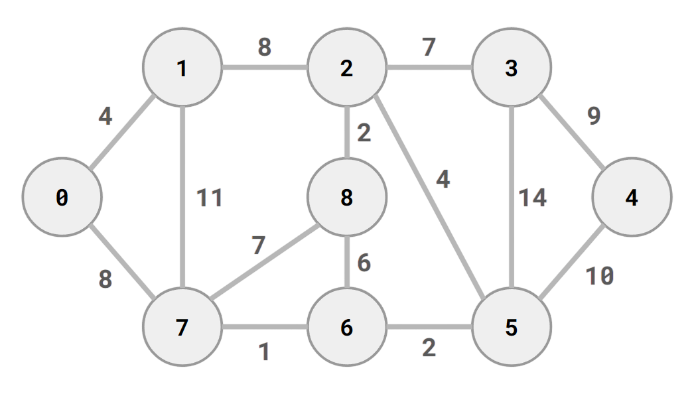

## Dijkstra's algorithm

A classic path-finding algorithm that returns the shortest path from a between a source and destination node.
This program is a great introduction to the **min heap** data structure; I originally wrote it using dynamic arrays, which also worked, but just not as well as this version.

## Graph example
The graph used to test the code is as follows:

